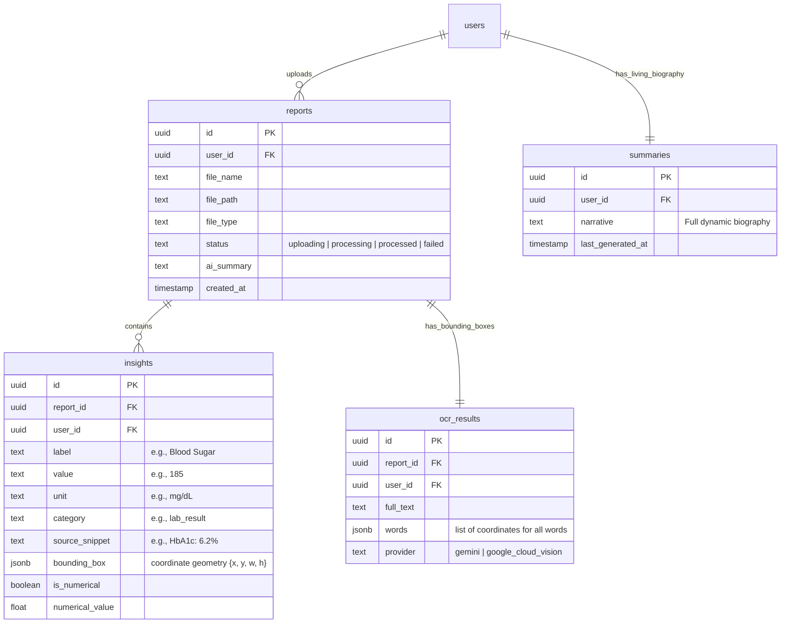

# MediTrace 🩺

### **The Digital Health Ledger & Hyperlinked Medical Biography**

**MediTrace** is a premium, self-hosted web application that transforms unstructured medical reports, laboratory results, and prescription scans into a chronological, interactive, and fully verifiable patient health biography.

At its core, MediTrace solves the critical problem of AI hallucinations in clinical summaries by implementing a custom **Citation & Visual Coordinate Engine**. When a patient reads their chronological biography (e.g., *"Diagnosed with Type 2 Diabetes in 2022"*), clicking the claim displays the original laboratory document side-by-side, drawing a highlighted boundary box directly over the physical text that confirms the claim.

---

## 📖 Table of Contents
1. [Core Features & Architecture](#-core-features--architecture)
2. [Detailed File Structure](#-detailed-file-structure)
3. [Database Schema & Data Model](#-database-schema--data-model)
4. [Supabase Edge Functions](#-supabase-edge-functions)
5. [Local Development Setup](#-local-development-setup)
6. [Deployment & Production Settings](#-deployment--production-settings)

---

## 🛠 Core Features & Architecture

### 1. The Ingestion & Processing Pipeline
* **File Upload**: Patients upload scanned reports (PNG, JPG, PDF) through the responsive `UploadPage`. Files are securely stored in the Supabase Storage Bucket `medical-reports`.
* **OCR Extraction**: Uses a dual OCR strategy. If `GOOGLE_CLOUD_VISION_API_KEY` is present, it uses Google's high-fidelity Cloud Vision API to map word bounding boxes. Otherwise, it delegates OCR to Google Gemini.
* **Structured AI Extraction**: Passes text to the direct Google Gemini API (`gemini-2.5-flash` model), returning a clean, validated JSON mapping of categorical insights (e.g., vital signs, lab results, diagnoses, medications).

### 2. The Citation Engine
* **Fuzzy Bounding-Box Alignment**: Implements a sliding-window coordinate matching algorithm (`fuzzyMatchBoundingBox`). It matches the AI-extracted "source snippet" text back to the spatial bounding boxes (X/Y coordinates) extracted during the OCR step.
* **Pixel Highlight Overlay**: When viewing a report in the frontend, coordinate percentages are utilized to dynamically render yellow canvas highlight bounding boxes over the scanned document image in real time.

### 3. The "Living Book" UI & Health Biography
* **Dynamic Chronological Biography**: An LLM synthesizes all historical reports into a readable, third-person narrative.
* **Dynamic Re-summarization**: If reports are modified or deleted, a re-sync triggers, updating the executive narrative so the patient record is always up to date.
* **Biomarker Trend Charts**: Extracts numerical data (like Blood Pressure, HbA1c, and Cholesterol levels) and automatically plots them on visual charts to track progress over years.

---

## 📂 Detailed File Structure

Below is the complete file and folder map of the application, now decoupled from all Lovable visual editor extensions:

```md
health-narrative/
├── .env                  # Local environment configuration (Supabase credentials & API keys)
├── .gitignore            # Excludes build assets, local envs, and lockfiles
├── README.md             # This exhaustive technical guide
├── components.json       # shadcn/ui framework configuration
├── eslint.config.js      # Project linting guidelines
├── index.html            # Web application entry canvas
├── package.json          # Node dependencies (decoupled from lovable-tagger)
├── postcss.config.js     # PostCSS tailwind compiler configurations
├── tailwind.config.ts    # Design tokens, typography, and styling variables
├── tsconfig.json         # Base TypeScript compilation configurations
├── tsconfig.app.json     # Client-specific TS build parameters
├── tsconfig.node.json    # Development-server TS config
├── vite.config.ts        # Vite compiler settings (Standard React build pipeline)
│
├── public/               # Static assets & illustrations
│
├── src/                  # Core frontend React code
│   ├── App.css           # Global layout adjustments
│   ├── App.tsx           # Client router and provider wrapping
│   ├── index.css         # Global styles and tailwind directives
│   ├── main.tsx          # React application bootstrapping anchor
│   │
│   ├── components/       # Reusable layout and presentation blocks
│   │   ├── ui/           # Custom shadcn UI components (button, dialog, input, etc.)
│   │   ├── AppLayout.tsx # Main dashboard frame with responsive wrappers
│   │   ├── AppSidebar.tsx# Navigation sidebar panel
│   │   ├── EventTimeline.tsx# Simple visual timeline marker
│   │   └── ThemeToggle.tsx# Smooth dark/light theme switch
│   │
│   ├── hooks/            # Custom utility react state triggers
│   │
│   ├── integrations/     # Database client layers
│   │   └── supabase/     
│   │       ├── client.ts # Supabase client hook for database queries
│   │       └── types.ts  # Strongly typed Postgres schema generated definitions
│   │
│   ├── lib/              # Utility configurations (Tailwind class mergers)
│   │
│   ├── pages/            # Core application screen controllers
│   │   ├── Auth.tsx          # Login and Register forms
│   │   ├── Biography.tsx     # The "Living Biography" narrative feed with hyperlinks
│   │   ├── ForgotPassword.tsx# Password recovery request screen
│   │   ├── Profile.tsx       # User profile details
│   │   ├── ReportPage.tsx    # Single report wrapper page
│   │   ├── ReportViewer.tsx  # Dynamic Side-by-Side viewer (highlighted coordinates + details)
│   │   ├── Reports.tsx       # Manage, view, and delete uploaded reports
│   │   ├── ResetPassword.tsx # Handle password resets
│   │   ├── Settings.tsx      # System configurations
│   │   ├── Timeline.tsx      # Vertical chronological medical ledger log
│   │   ├── Trends.tsx        # Responsive Recharts plots of biological trends
│   │   └── UploadPage.tsx    # File drag-and-drop ingestion interface
│   │
│   └── types/            # Application type definitions
│
└── supabase/             # Backend Database & Cloud functions (Deno)
    ├── config.toml       # Local Supabase settings (verification & configurations)
    │
    ├── migrations/       # PostgreSQL SQL schemas for database tables
    │   ├── 20260217204007_schema.sql  # Sets up tables (reports, insights, summaries, etc.)
    │   └── ...
    │
    └── functions/        # Serverless backend functions (Deno)
        ├── generate-biography/
        │   └── index.ts  # Synthesizes all database insights using gemini-2.5-flash
        └── process-report/
            └── index.ts  # Downloads scan, runs OCR, extracts JSON schema via gemini-2.5-flash
```

---

## 🗄 Database Schema & Data Model

The application utilizes 4 key database tables to track records, visual bounding coordinates, and biographical summaries:



---

## ⚡ Supabase Edge Functions

Backend processing logic is decoupled from external gateways and runs inside native **Supabase Edge Functions** (built on Deno), interacting directly with the free tier of the **Google Gemini API**:

### 1. `process-report`
* **Trigger**: Triggered via an API call from the React application when a file upload completes.
* **Process**:
  1. Downloads the uploaded medical file from the `medical-reports` bucket.
  2. Runs OCR (utilizing Google Cloud Vision if key is configured, or Gemini if using the all-free configuration).
  3. Sends the document image to `gemini-2.5-flash` using standard OpenAI-compatible requests at the Gemini endpoint: `https://generativelanguage.googleapis.com/v1beta/openai/chat/completions`.
  4. Parses the returned structured JSON mapping biological claims and their source text.
  5. Computes overlapping coordinates using fuzzy bounding box alignment.
  6. Stores coordinates inside `ocr_results`, inserts matching items in `insights`, and transitions report status to `processed`.

### 2. `generate-biography`
* **Trigger**: Executed whenever insights are modified, added, or deleted.
* **Process**:
  1. Gathers all structured historical insights linked to the patient ID.
  2. Submits insights chronologically to the Gemini API (`gemini-2.5-flash`).
  3. Returns a unified biographical narrative containing patient-friendly text embedded with custom markdown citations linking to original report UUIDs.
  4. Upserts this narrative into the `summaries` table.

---

## 💻 Local Development Setup

Follow these steps to set up MediTrace on your local machine:

### 1. Clone & Set Up Frontend
1. Install Node dependencies:
   ```bash
   npm install
   # or
   bun install
   ```
2. Configure local variables. Create a `.env` file in the root of the project:
   ```env
   VITE_SUPABASE_URL="https://your-supabase-project.supabase.co"
   VITE_SUPABASE_ANON_KEY="your-anon-key-here"
   GEMINI_API_KEY="your-google-ai-studio-gemini-key"
   ```
3. Run the development server:
   ```bash
   npm run dev
   # or
   bun run dev
   ```

### 2. Run Supabase Backend Locally
1. Initialize the Supabase database:
   ```bash
   supabase init
   ```
2. Start the local Supabase container server:
   ```bash
   supabase start
   ```
3. Run migrations:
   ```bash
   supabase migration up
   ```
4. Serve the Edge Functions locally:
   ```bash
   supabase functions serve --no-verify-jwt
   ```

---

## 🚀 Deployment & Production Settings

To transition your decoupled application to a production environment:

### 1. Deploy the Frontend
The web app is a standard Vite React build. You can deploy it to any static web host, such as **Vercel**, **Netlify**, or **GitHub Pages**:

* Build command: `npm run build`
* Output directory: `dist`
* Be sure to set `VITE_SUPABASE_URL` and `VITE_SUPABASE_ANON_KEY` as production environment variables in your deployment dashboard.

### 2. Deploy Supabase Database and Edge Functions
1. Create a new, free project on [Supabase.com](https://supabase.com/).
2. Link your local project to your remote Supabase instance:
   ```bash
   supabase link --project-ref your_remote_project_id
   ```
3. Apply migrations to your remote production database:
   ```bash
   supabase db push
   ```
4. Deploy the two serverless Edge Functions:
   ```bash
   supabase functions deploy process-report
   supabase functions deploy generate-biography
   ```

### 3. Bind AI Secret Keys in Production
Provide your free Gemini key directly to your Supabase remote instance so the deployed functions can authenticate safely:

```bash
# Set your Gemini API key (Required for AI analysis and narrative summaries)
supabase secrets set GEMINI_API_KEY="your-api-studio-key"

# Set your Google Vision API key (Optional: for advanced OCR coordinate matching)
supabase secrets set GOOGLE_CLOUD_VISION_API_KEY="your-google-cloud-vision-key"
```

---

## 🔒 Security Best Practices
* **Database RLS**: Enable Row Level Security (RLS) on `reports`, `insights`, and `summaries` tables to ensure users can only query, view, or delete their own health data.
* **Storage Protection**: Set the `medical-reports` Supabase storage bucket security settings to **Private**, allowing read permissions only to authenticated account owners.
